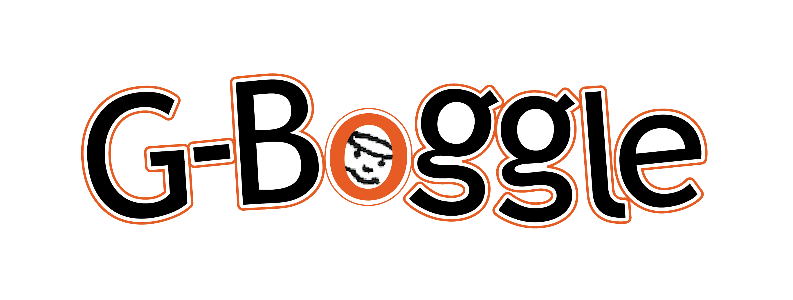

<!-- SHIELDS -->
[![Contributors][contributors-shield]][contributors-url]
[![MIT License][license-shield]][license-url]

<!-- PROJECT LOGO -->
 

  

    Boggle, but now playable on the web with your friends!
  

<!-- TABLE OF CONTENTS -->

  
Table of Contents

  <ol>
    <li>
      <a href="#about-the-project">About The Project</a>
      <ul>
        <li><a href="#built-with">Built With</a></li>
      </ul>
    </li>
    <li>
      <a href="#getting-started">Getting Started</a>
      <ul>
        <li><a href="#installation">Installation</a></li>
      </ul>
    </li>
    <li><a href="#license">License</a></li>
    <li><a href="#contact">Contact</a></li>
  </ol>

<!-- ABOUT THE PROJECT -->
## About The Project

[![Product Name Screen Shot][product-screenshot]](https://example.com)

There are many great README templates available on GitHub, however, I didn't find one that really suit my needs so I created this enhanced one. I want to create a README template so amazing that it'll be the last one you ever need -- I think this is it.

Here's why:
* Your time should be focused on creating something amazing. A project that solves a problem and helps others
* You shouldn't be doing the same tasks over and over like creating a README from scratch
* You should implement DRY principles to the rest of your life :smile:

Of course, no one template will serve all projects since your needs may be different. So I'll be adding more in the near future. You may also suggest changes by forking this repo and creating a pull request or opening an issue. Thanks to all the people have have contributed to expanding this template!

A list of commonly used resources that I find helpful are listed in the acknowledgements.

### Built With

* [Svelte](https://svelte.dev/)
* [Express](https://expressjs.com/)
* [Redis](https://redis.io/)
* [Rollup](https://rollupjs.org/guide/en/)
* [Typescript](https://www.typescriptlang.org/)

<!-- GETTING STARTED -->
## Getting Started

This is an example of how you may give instructions on setting up your project locally.
To get a local copy up and running follow these simple example steps.

### Installation

1. Make sure nodejs and npm are installed
   - Debian: 
     `curl -fsSL https://deb.nodesource.com/setup_16.x | bash -` (run as root, not sudo) (version may vary) 
     `apt install nodejs` (run as root)
   - Arch Linux: 
     `pacman -S nodejs npm`
   - Windows: 
     https://www.npmjs.com/get-npm
2. Make executables executable (if not executable already)
   - `chmod +x ./run.sh`
   - `chmod +x ./boggle-api/run-redis.sh`
   - `chmod +x ./install-npm-dependencies.sh` (optional)
3. Install npm dependencies
   - `./install-npm-dependencies.sh` 
     or
   - `npm install --prefix ./boggle-sveltexpress/svelte` 
     `npm install --prefix ./boggle-sveltexpress/express` 
     `npm install --prefix ./boggle-api` 
     optionally: 
     `npm audit fix --prefix ./boggle-sveltexpress/svelte` 
     `npm audit fix --prefix ./boggle-sveltexpress/express` 
     `npm audit fix --prefix ./boggle-api` 
     or you can navigate to all the directories with a package.json and run `npm install` in that directory (and optionally `npm audit fix`)
4. Install Redis Server
   - Debian: 
     `apt install redis-server`
   - Arch Linux: 
     `pacman -S redis`
   - Windows: 
     https://redislabs.com/blog/redis-on-windows-10/
5. Add a file called `.api_key` to `./boggle-sveltexpress/express/` and `./boggle-api/` containing a same value (used for submitting highscores)
6. Run application with the `run.sh` script

<!-- LICENSE -->
## License

Distributed under the MIT License. See `LICENSE` for more information.

<!-- CONTACT -->
## Contact

Jan Vlasman - [Website](https://portfolio-jan-vlasman.herokuapp.com/index.html) - jan.vlasman99@gmail.com

Jitze Jan Kerkstra - [Website](https://jitzek.github.io/index.html) - Jitz_k@hotmail.com

<!-- LINKS AND IMAGES -->
[contributors-shield]: https://img.shields.io/github/contributors/Jitzek/GBoggle.svg?style=for-the-badge
[contributors-url]: https://github.com/Jitzek/GBoggle/graphs/contributors
[license-shield]: https://img.shields.io/github/license/Jitzek/GBoggle.svg?style=for-the-badge
[license-url]: https://github.com/Jitzek/GBoggle/blob/master/LICENSE
